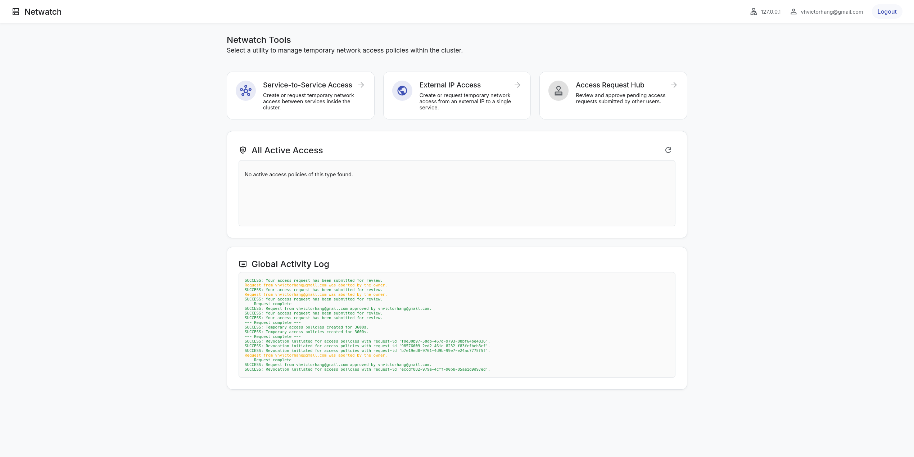
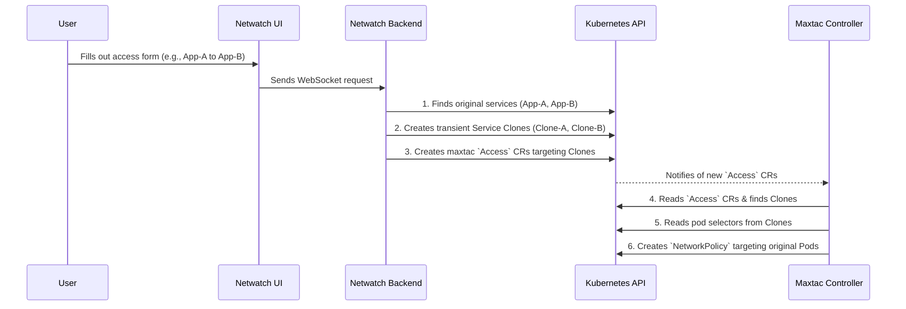

# Netwatch

**Netwatch** is a secure, web-based UI and controller for managing temporary Kubernetes network access policies. It provides a user-friendly interface for developers to request and for administrators to approve temporary access between services or from external IPs, leveraging the power of the `maxtac` network policy engine.

The entire workflow is Kubernetes-native, using Custom Resources for managing access requests and leveraging RBAC with OIDC for secure, impersonated operations.

<p align="center">
  
</p>

## ✨ Features

- **Service-to-Service Access**: Create temporary, time-bound access between two services in the cluster.
- **External IP Access**: Grant temporary access from an external IP/CIDR to a specific service.
- **Request & Approval Workflow**:
  - Users can submit requests for access policies.
  - Approvers can view, approve, or deny requests from a central "Request Hub".
  - Users with partial permissions (e.g., only in one namespace) can create "half" of an access policy for an approver to complete.
  - Users with sufficient permissions can self-approve their own requests or create policies directly.
- **Secure by Design**:
  - **OIDC Integration**: Authenticates users against your organization's identity provider.
  - **Kubernetes Impersonation**: All actions are performed on behalf of the logged-in user, fully respecting the cluster's RBAC policies.
  - **Stateless Backend**: The application is fully stateless; all pending requests are stored as `AccessRequest` Custom Resources in the Kubernetes API server.

## 🏗️ Architecture

Netwatch consists of two primary components that are deployed as separate Kubernetes Deployments:

1. **Netwatch Webserver**: A Go web application built with the Gin framework. It serves the frontend UI, handles user authentication via OIDC, and manages the lifecycle of `AccessRequest` CRs. It also provides a WebSocket endpoint for real-time logging.
2. **Netwatch Cleanup Controller**: A standard Kubernetes controller built with `controller-runtime`. It watches for the deletion of `maxtac` `Access` and `ExternalAccess` resources and uses finalizers to ensure that the associated cloned `Service` objects are garbage collected.

The application relies on two sets of Custom Resource Definitions (CRDs):

- **`Access` & `ExternalAccess`** (from the `maxtac.vtk.io` API group)(from my own controller [Maxtac](https://github.com/Banh-Canh/MaxTac)): These are the resources that the underlying `maxtac` network policy engine understands and enforces.
- **`AccessRequest`** (from the `netwatch.vtk.io` API group): This CRD is created and managed by Netwatch to store the state of pending access requests.

### High-Level Flow



### The Service Cloning Mechanism

1. User Request: A user requests access from a source service (e.g., monitoring/prometheus) to a target service (e.g., default/database).

2. Service Cloning: The Netwatch backend receives the request and performs the following actions:

- It finds the original Service objects for prometheus and database.

- It reads their crucial spec.selector fields (e.g., app: prometheus and app: database). This selector is the link to the actual application pods.

- It creates two new, temporary Service objects called clones. These clones are just lightweight metadata objects.

- Crucially, each clone:

  - Inherits the spec.selector from its original service.

  - Is assigned a new, unique label shared between them, for example: netwatch.vtk.io/request-id: 1a2b3c4d.

3. Decoupled Policy Creation: Netwatch then creates the `maxtac.vtk.io/v1alpha1.Access` custom resources. Instead of targeting the original services, the serviceSelector in these new Access objects is configured to target the unique label of the clones:

```yaml
# Example Access object created by Netwatch
apiVersion: maxtac.vtk.io/v1alpha1
kind: Access
metadata:
  name: access-netwatch-clone-prometheus-1a2b3c4d
  namespace: monitoring
spec:
  serviceSelector:
    matchLabels:
      # It ONLY targets the clone, not the original service.
      netwatch.vtk.io/request-id: 1a2b3c4d
  targets:
    - serviceName: netwatch-clone-database-1a2b3c4d
      namespace: default
```

This is because of how MaxTac works and also to leave untouched original services deployment that might not provide a way for user-labeling.

4.The maxtac controller, which is watching `Access` resources, sees the new policy.

    - It uses the serviceSelector to find the service clone (netwatch-clone-prometheus-1a2b3c4d).

    - It reads the pod selector (app: prometheus) that was inherited by the clone.

    - It then generates a low-level Kubernetes NetworkPolicy that uses this pod selector (app: prometheus), ensuring the final network rule correctly targets the actual application pods without ever having touched the original prometheus service object.

This pattern ensures that Netwatch is a safe, additive system. When the Access objects are deleted, the Netwatch Cleanup Controller finds and deletes the associated service clones by their shared request-id label, leaving the system in its original state.

### Component Responsibilities

- Netwatch Webserver:

  - Serves the UI.

  - Handles OIDC authentication.

  - Manages the lifecycle of AccessRequest CRs (the "Pending Requests").

  - Performs SubjectAccessReview checks to authorize user actions.

  - Orchestrates the creation of Service clones and maxtac CRs (by impersonating connected user identity in kubernetes).

- Netwatch Cleanup Controller:

  - A simple controller that runs in the background.

  - Uses a Finalizer on Access and ExternalAccess objects to ensure that when they are deleted, the corresponding Service clones are also deleted.

- AccessRequest CRD (netwatch.vtk.io):

  - Acts as the stateless data store for the "Request Hub".

  - Holds the complete definition and status (PendingFull, PendingTarget, etc.) of a user's request before it is approved.

## 🚀 Getting Started

### Prerequisites

- A running Kubernetes cluster.
- The OIDC configured in your kubernetes cluster.
- `kubectl` configured to connect to your cluster.
- An OIDC provider (like Keycloak, Google, etc.) configured with a client for Netwatch.

## ⚙️ Configuration

Netwatch is configured entirely through environment variables. For local development, you can place these in a `.env` file in the root of the project. For production deployments, these should be managed via Kubernetes Secrets and ConfigMaps.

| Variable                  | Description                                                                                                                   | Example                                               | Required      |
| ------------------------- | ----------------------------------------------------------------------------------------------------------------------------- | ----------------------------------------------------- | ------------- |
| **OIDC**                  |                                                                                                                               |                                                       |               |
| `OIDC_ISSUER_URL`         | The full URL to your OIDC provider's discovery endpoint.                                                                      | `"https://keycloak.example.com/auth/realms/my-realm"` | **Yes**       |
| `OIDC_CLIENT_ID`          | The client ID for the Netwatch application, as configured in your OIDC provider.                                              | `"netwatch-client"`                                   | **Yes**       |
| `OIDC_CLIENT_SECRET`      | The client secret for the Netwatch application.                                                                               | `"a-very-long-and-secret-string"`                     | **No**        |
| **Session**               |                                                                                                                               |                                                       |               |
| `NETWATCH_SESSION_SECRET` | A long (32 or 64 bytes), random, and secret string used to sign and encrypt user session cookies. Treat this like a password. | `"generate-a-long-random-string-here"`                | **Yes**       |
| `NETWATCH_SESSION_TTL`    | The Time-To-Live (lifetime) of a user's session in seconds. Defaults to `3600` (1 hour).                                      | `"86400"` (for 24 hours)                              | No            |
| **Redis (Logging)**       |                                                                                                                               |                                                       |               |
| `REDIS_ADDR`              | The address (`host:port`) of the Redis instance used for real-time activity logging.                                          | `"redis.netwatch.svc.cluster.local:6379"`             | No (Optional) |
| `REDIS_USERNAME`          | The username for Redis authentication, if required.                                                                           | `"default"`                                           | No (Optional) |
| `REDIS_PASSWORD`          | The password for Redis authentication, if required.                                                                           | `"your-redis-password"`                               | No (Optional) |
| **Application**           |                                                                                                                               |                                                       |               |
| `NETWATCH_PORT`           | The port on which the Netwatch web server will listen. Defaults to `3000`.                                                    | `"8080"`                                              | No            |
| `NETWATCH_API_TOKEN`      | A static bearer token for programmatic API access, bypassing OIDC. Useful for scripts or automation.                          | `"a-secure-random-token-for-automation"`              | No (Optional) |

## 🚀 Installation

Netwatch is designed to be deployed easily using a single, pre-packaged YAML bundle. This bundle includes all the necessary Kubernetes resources (Deployments, Services, RBAC, etc.) to get the application running.

### Step 1: Download the Release Bundle

Go to the [**Releases** page](https://github.com/Banh-Canh/netwatch/releases) of the Netwatch GitHub repository and download the `bundle-*.yaml` file from the latest release.

For example:

```bash
# Replace v0.0.0 with the desired version
curl -L -o netwatch-bundle.yaml https://github.com/Banh-Canh/netwatch/releases/download/v0.0.0/netwatch-bundle.yaml
```

### Step 2: Configure Environment Variables

The downloaded `netwatch-bundle.yaml` file contains a `ConfigMap` and a `Secret` resource that hold the application's configuration. You must edit this file to provide your environment-specific values before deploying.

1. **Open `bundle-*.yaml`** in your preferred text editor.
2. **Locate the `Deployment`** of netwatch. Update the environment variables fields with your configuration values, such as your OIDC issuer URL.

## 🧑‍💻 Usage

Login: Access the Netwatch UI in your browser and log in with your OIDC provider

### Step 3: Deployment

Apply the bundle.

### Select a Tool

- Service-to-Service Access: To create a policy between two services.
- External IP Access: To create a policy from an outside IP/CIDR.
- Access Request Hub: To view and manage pending requests.
- Create or Submit a Request:

Fill out the form with the source, target, ports, and duration.

If you have sufficient permissions, the "Create Access" button will create the policy directly.

Otherwise, use the "Submit for Review" button. You can add a description for context.
If you have partial permissions, Netwatch will automatically create the parts of the policy you're authorized for, leaving the rest for an approver.

- Approve/Deny:
  In the Access Request Hub, approvers will see a list of pending requests.

The UI clearly shows the permissions needed to approve each request. If some have already been satisfied by a partial submission, they will be marked in green with a checkmark.

Approvers can Approve or Deny. The original requestor can Abort their own request. If a requestor also has full approval permissions, they will see both an "Approve" and "Abort" button on their own request.
